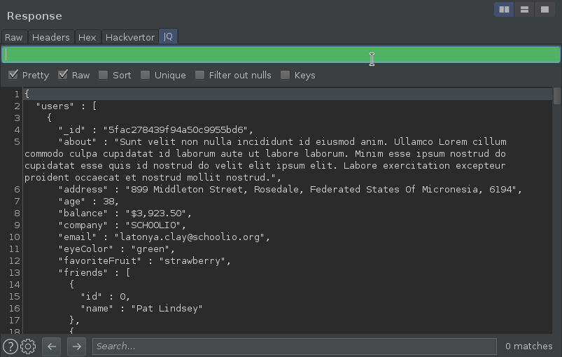

# Burp JQ

This is a Burp Extension to apply [jq](https://github.com/stedolan/jq) queries
to JSON content from the HTTP message viewer.



## Build

```bash
$ gradle fatJar
```

## Credits

Burp JQ relies on `jackson-jq`, a Java implementation of `jq`.

- [jq](https://github.com/stedolan/jq)
- [jackson](https://github.com/FasterXML/jackson)
- [jackson-jq](https://github.com/eiiches/jackson-jq)

